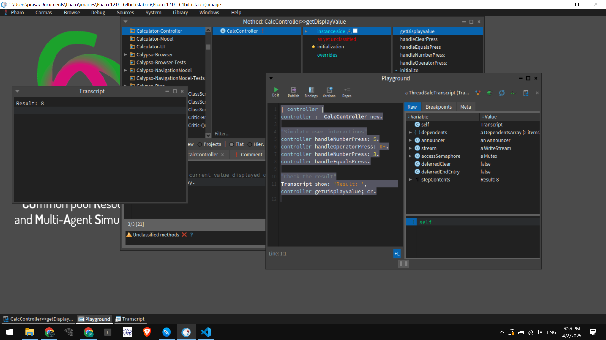
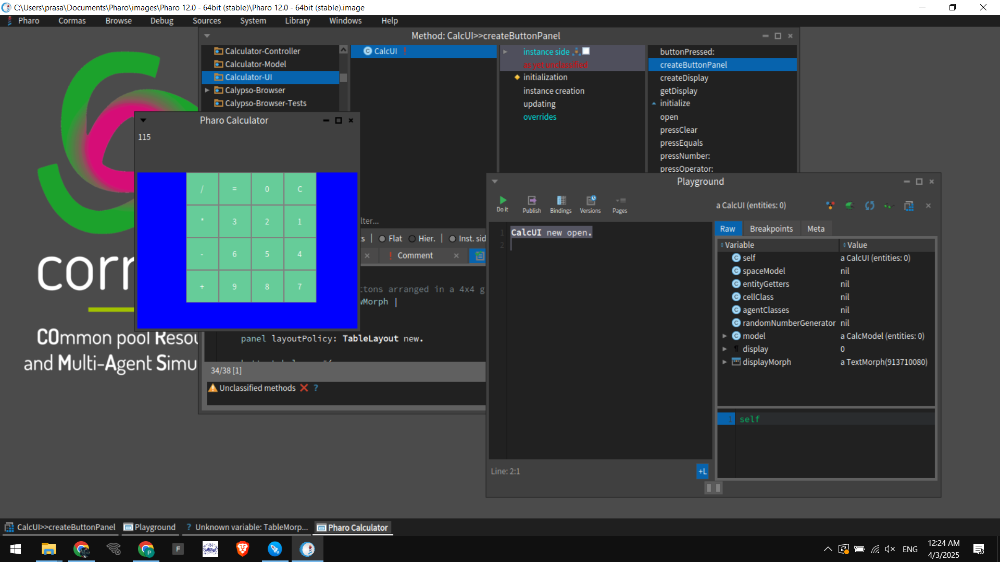

# 🧮 Simple Calculator in Pharo: Model & UI Versions


## 📌 Introduction
This repository contains two versions of a simple **Pharo Calculator**:
1. **Non-UI Version** – A calculator model with a controller, operating via code (ideal for understanding the core logic).
2. **UI Version** – An extended version that builds a **Graphical User Interface** using Pharo's **Morphic** framework, mimicking a real calculator.

Both versions support basic arithmetic operations: **addition (+), subtraction (-), multiplication (*), and division (/)**. The design follows the **Model-View-Controller (MVC)** pattern for clean separation of concerns.

---

## 📂 Project Structure
The project is divided into two main parts:

```
Calculator-Model/        # Contains the core logic (CalcModel)
Calculator-Controller/    # Manages user interactions (CalcController)
Calculator-UI/          # (UI version only) Handles the graphical user interface (CalcUI)
```

---

## 🛠️ Implementation

### **1️⃣ Non-UI Version**

#### **CalcModel (Core Logic)**
```smalltalk
CMAbstractModel << #CalcModel
    slots: { #currentValue. #previousValue. #operator };
    package: 'Calculator-Model'.

CalcModel >> initialize
    "Initialize default values"
    currentValue := 0.
    previousValue := 0.
    operator := nil.

CalcModel >> setOperator: anOperator
    "Set the operator (+, -, *, /) and store the previous value"
    operator := anOperator.
    previousValue := currentValue.
    currentValue := 0.

CalcModel >> updateValue: aNumber
    "Append a digit to the current value"
    currentValue := (currentValue * 10) + aNumber.

CalcModel >> computeResult
    "Compute the result based on the stored operator"
    operator ifNotNil: [
        currentValue := (operator = #+) ifTrue: [previousValue + currentValue]
                     ifFalse: [(operator = #-) ifTrue: [previousValue - currentValue]
                     ifFalse: [(operator = #*) ifTrue: [previousValue * currentValue]
                     ifFalse: [(operator = #/) ifTrue: [previousValue / currentValue]
                     ifFalse: [currentValue]]]].
        operator := nil.
    ].

CalcModel >> clear
    "Reset calculator"
    currentValue := 0.
    previousValue := 0.
    operator := nil.

CalcModel >> getCurrentValue
    "Get the current value for display"
    ^ currentValue.
```

#### **CalcController (User Interaction)**
```smalltalk
CMAbstractModel << #CalcController
    slots: { #model };
    package: 'Calculator-Controller'.

CalcController >> initialize
    "Initialize the controller with a model instance."
    model := CalcModel new.

CalcController >> handleNumberPress: aNumber
    "Handle number button press and update model."
    model updateValue: aNumber.

CalcController >> handleOperatorPress: anOperator
    "Handle operator button press and update model."
    model setOperator: anOperator.

CalcController >> handleEqualsPress
    "Handle equals button press and compute the result."
    model computeResult.

CalcController >> handleClearPress
    "Handle clear button press to reset the calculator."
    model clear.

CalcController >> getDisplayValue
    "Retrieve the current value displayed on the calculator."
    ^ model getCurrentValue.
```

#### **Running the Non-UI Calculator**
To test the non-UI version, open the **Pharo Playground** and execute:

```smalltalk
| controller |
controller := CalcController new.

controller handleNumberPress: 5.
controller handleOperatorPress: #+.
controller handleNumberPress: 3.
controller handleEqualsPress.

Transcript show: 'Result: ', controller getDisplayValue printString; cr.
```

#### **Expected Output**
```
Result: 8
```

#### **Screenshots (Non-UI)**



---

### **2️⃣ UI Version**

The UI version extends the non-UI version by adding a graphical interface using Morphic.

#### **CalcUI (Graphical User Interface)**
```smalltalk
CMAbstractModel << #CalcUI
    slots: { #model. #display. #displayMorph };
    package: 'Calculator-UI'.

CalcUI >> initialize
    "Initialize the UI with a model instance and set up the display"
    model := CalcModel new.
    display := '0'.

CalcUI >> createDisplay
    "Create a text display for showing input and results."
    displayMorph := TextMorph new.
    displayMorph contents: model getCurrentValue asString.
    displayMorph width: 200.
    displayMorph height: 40.
    displayMorph beAllFont: (LogicalFont familyName: 'Arial' pointSize: 18).
    displayMorph borderWidth: 2.
    ^ displayMorph.

CalcUI >> createButtonPanel
    "Create a panel with buttons arranged in a 4x4 grid layout."
    | panel buttonLabels rowMorph |
    panel := Morph new.
    panel layoutPolicy: TableLayout new.
    
    buttonLabels := #(
        ('7' '8' '9' '+')
        ('4' '5' '6' '-')
        ('1' '2' '3' '*')
        ('C' '0' '=' '/')
    ).
    
    buttonLabels do: [ :row |
        rowMorph := Morph new.
        rowMorph layoutPolicy: RowLayout new.
        row do: [ :label |
            | button |
            button := SimpleButtonMorph new.
            button label: label.
            button target: self.
            button actionSelector: #buttonPressed:.
            button arguments: { label }.
            button extent: 50@50.
            rowMorph addMorph: button.
        ].
        panel addMorph: rowMorph.
    ].
    ^ panel.

CalcUI >> buttonPressed: label
    "Handle button press events."
    (label first isDigit) ifTrue: [ self pressNumber: label asNumber ].
    (#('+', '-', '*', '/') includes: label) ifTrue: [ self pressOperator: label asSymbol ].
    (label = '=') ifTrue: [ self pressEquals ].
    (label = 'C') ifTrue: [ self pressClear ].
    self updateDisplay.

CalcUI >> updateDisplay
    "Update the display based on the model's current value."
    displayMorph contents: model getCurrentValue asString.
    displayMorph changed.

CalcUI >> pressNumber: aNumber
    "Handle number button press."
    model updateValue: aNumber.
    self updateDisplay.

CalcUI >> pressOperator: anOperator
    "Handle operator button press."
    model setOperator: anOperator.
    self updateDisplay.

CalcUI >> pressEquals
    "Handle equals button press and compute the result."
    model computeResult.
    self updateDisplay.

CalcUI >> pressClear
    "Handle clear button press."
    model clear.
    self updateDisplay.

CalcUI >> getDisplay
    "Getter for display text."
    ^ display.

CalcUI >> open
    "Open the calculator UI in a Morphic window."
    | window |
    window := SystemWindow labelled: 'Pharo Calculator'.
    window addMorph: self createDisplay frame: (0@0 corner: 1@0.2).
    window addMorph: self createButtonPanel frame: (0@0.2 corner: 1@1).
    window openInWorld.
```

#### **Running the UI Calculator**
To run the UI version, execute in the **Pharo Playground**:

```smalltalk
CalcUI new open.
```

This will open a window with a display area and a 4x4 grid of buttons that mimic a real calculator.

#### **Screenshots (UI Version)**





---

## 🏆 Features
✔ **Basic Arithmetic Operations** (`+`, `-`, `*`, `/`)  
✔ **Sequential Calculation** (Step-by-step input)  
✔ **Clear Functionality** (Resets calculator)  
✔ **Simple, Readable Code**  
✔ **Graphical User Interface** (Morphic-based for UI version)

---

## 📌 Next Steps
- 🔹 **Improve Error Handling** (e.g., division by zero)
- 🔹 **Implement Advanced Features** (e.g., support for decimals, parentheses)
- 🔹 **Enhance UI** (e.g., keyboard input, themes)
- 🔹 **Refactor for Modularity** if additional features are added

---

## 📝 Conclusion
This Pharo calculator demonstrates key concepts in **object-oriented programming (OOP)** and **message passing** using Smalltalk. Whether you prefer the simplicity of a non-UI model or the interactivity of a GUI version, this project serves as a foundation for further enhancements.  

HappyCoding 🚀 | Everything is an Object 😉.

