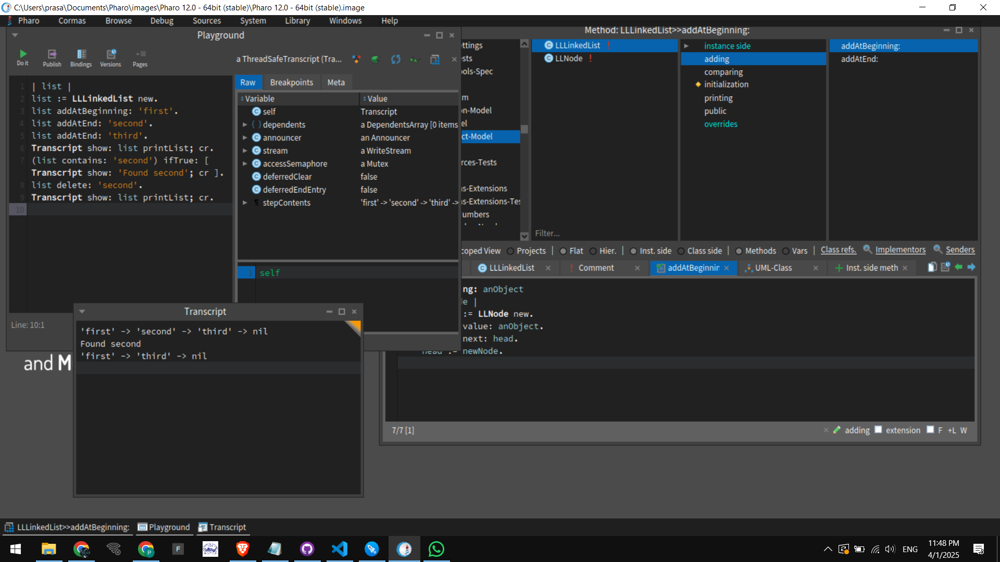

# LinkedListProject in Pharo Cormas

## 📷 Screenshot


## Overview
This mini project demonstrates a basic linked list implementation in Pharo using the Cormas framework. The project contains two main classes:

- **LLNode**: Represents an individual node in the linked list. Each node holds a `value` and a reference to the next node (`next`).
- **LLLinkedList**: Manages the linked list and implements basic operations such as insertion at the beginning/end, deletion, search, and printing the list.

## Project Structure
- **Package:** `LinkedListProject-Model`
- **Classes:**
  - `LLNode`  
    - Instance variables: `value`, `next`
  - `LLLinkedList`  
    - Instance variable: `head`
    - Key methods:
      - `initialize` — Sets up the list.
      - `addAtBeginning:` — Inserts a node at the start.
      - `addAtEnd:` — Appends a node at the end.
      - `delete:` — Removes the first occurrence of a value.
      - `contains:` — Checks if the list contains a given value.
      - `printList` — Returns a string representation of the list.

## Setup Instructions
1. **Install Pharo and Cormas:**  
   Ensure you have Pharo and the Cormas framework installed on your machine.

2. **Create a New Model:**  
   - Open your Cormas image.
   - Go to the **"Cormas"** menu and select **"New Model"**.
   - Name your model `LinkedListProject` and set the prefix (e.g., `LL`).
   - Uncheck **"Create a test package"** if you don’t plan to add tests immediately.
   - Click **"Create"** to generate the model.

3. **Add Classes:**  
   - Create the `LLNode` class with instance variables `value` and `next`.
   - Create the `LLLinkedList` class with an instance variable `head`.
   - Implement the methods as described in the project structure.

4. **Test the Implementation:**  
   Open a Workspace and evaluate the following code snippet to test your linked list:

   ```smalltalk
   | list |
   list := LLLinkedList new.
   list addAtBeginning: 'first'.
   list addAtEnd: 'second'.
   list addAtEnd: 'third'.
   Transcript show: list printList; cr.
   
   (list contains: 'second') ifTrue: [ Transcript show: 'Found second'; cr ].
   list delete: 'second'.
   Transcript show: list printList; cr.
